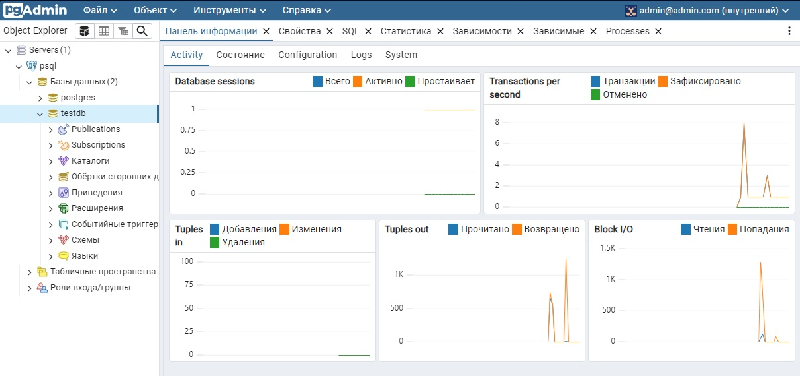

# Развертывание PostgreSQL и pgAdmin в Kubernetes

Этот проект содержит манифесты Kubernetes для развертывания PostgreSQL и веб-интерфейса pgAdmin с использованием типа сервиса `LoadBalancer`.

## Содержание

- [Описание](#описание)
- [Установка](#установка)
- [Доступ к pgAdmin](#доступ-к-pgadmin)

## Описание

- postgres14.yml  **PostgreSQL**: реляционная база данных.
- pgadmin.yml     **pgAdmin**: веб-интерфейс для управления PostgreSQL.

### Архитектура

<p align="center">
  
</p>

## Установка

1. Примените манифест с помощью следующей команды:

```bash
  kubectl apply -f postgres14.yml
  kubectl apply -f pgadmin.yml
```

2. Доступ к pgAdmin

```bash
  kubectl get services
```

Найдите IP-адрес, связанный с сервисом `pgadmin-service`, и откройте его в браузере. Войдите в систему, используя следующие учетные данные:

- **Email**: `admin@admin.com`
- **Пароль**: `admin`

`pgadmin` : <http://localhost:5050/>
<p align="center">
  
</p>

### Подключение к PostgreSQL

Для подключения к базе данных PostgreSQL в pgAdmin используйте следующие параметры:

- **Host**: `postgres-service` Cluster-IP
- **Port**: `5432`
- **Username**: `postgres`
- **Password**: `password`
